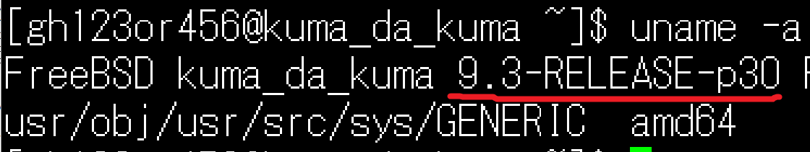

<!-- $theme: gaia -->
<!-- page_number: true -->
<!-- template: invert -->
<!-- prerender: true -->

# サーバ公開勘所  

## -自分はこうしてます編-

---

##  今回のお題は？

- 誰もが気にするセキュリティー周り
- 特にOSやミドルウェアの話を共有したい！

---

##  こんなこと考えてます

- 3W1Hを明確に
- 最新版を追いかける
- 登場人物と役割を決める
- ソフトを知ってさらに固める

---

##  3W1Hを明確に

#### __誰__ が __いつ__ __何処__ から __どう__ 使うか  
   
- サーバの最小構成が決まる
- 「やってはいけない事」がハッキリする

---

##  我が家の要望は・・・

* **誰 - who**
  - 自分と他友人2人くらい

* **何処 / いつ - where/when**
  - いつでも、日本国内のどこからでも

* **どう使う - how**
  - 作ったサイトの実験場が欲しい！ 
  - ファイルの共有場所あったら便利だよね！
  - 専用wikiとかどうですか！
  - Minecraftしたい！

---

##  そんな我が家のサーバ構成

サーバの構成が決まったらインストールしていく

---

## 最新版を追いかける
#### 最初はOSについて

- 特別な理由がない限り、
  　できるだけ最新のものがよいです。

- パッチもどんどん出るので
   　インストール直後は最新化する。

---

## 我が家のOSはバージョン何？
BSDは` uname -a `で確認。

んんー？

---

## OS最新化とパッチ充て
#### 基本的に公式サイトに載っている通りにやる
- OSのメジャーアップデート
`freebsd-update -r 11.1-RELEASE upgrade`

- セキュリティパッチの適用
`freebsd-update install`

コマンドごと変わった

---

## ソフトのインストール
#### パッケージ管理ソフトに頼る
- 管理ツールのDB更新
`pkg update -f`

- ソフトをインストールする
`pkg install nginx`

ここで構成管理ツール(Ansibleとか)を使うのもあり

---

## 古いソフトの更新
- 管理ツールから最新版があるか確認できる
`pkg version -l '<'`

- まとめて更新
`pkg upgrade`

手動でソースからインストールしていたりすると
管理ツールの監視から外れるので
難易度が跳ね上がる。上級者向け。

---

## 登場人物と役割を決める
#### 各ユーザの使い方を明確にすること
- 管理者、作業者、システムユーザ、など
  各ユーザのできることは明確にする。

- sudoを使ってコマンド単位で委任するのが定石
  -> ありがちなのは、すべてのコマンドをsudoできる影の管理者

---

## 登場人物と役割を決める
不要なユーザはnologinにしてしまうか削除する。
- ありがちなのは、
　「guest」「test」「admin」「tomcat」など？
 
- 参考 
[不要なデフォルト・ユーザー・アカウントの除去(IBMの記事)](https://www.ibm.com/support/knowledgecenter/ja/ssw_aix_61/com.ibm.aix.security/remove_default_usr_accts.htm)

---

## ソフトを知ってさらに固める
#### メジャーなソフトのメジャーな対応
ソフトによってはセキュリティを高められる
機能があるので活用していく。

- sshd
  - ポート変更
  - rootログインの拒否
  - 鍵認証
  - パスワードログインの拒否

---

## ソフトを知ってさらに固める
- nginx
  - 応答に余計な情報を載せないようにする
  　`server_tokens off` などなど
  - ファイルの公開決定
  - SSL対応
  - etc etc etc.....
　
 
できることが多すぎるので、外部の評価ツールに
頼るのがよいかと思う

---

## ソフトを知ってさらに固める
#### メジャーな脆弱性対応
話題になりそうなものは適宜対応する
自分が当てにするのは以下

- 脆弱性の特設サイト
- IPA先生のアナウンス
- OSの公式サイト(セキュリティパッチ)
- ソフトのサイト
- VPSを借りてるサイトのアナウンス(さくら)
- CVE/JNV
---

#### 我が家はこんな状況でした

|脆弱性|状況|
|:-:|:-|
|POODLE|SSL3.0は無効にした|
|ShellShock|bashは更新済み|
|Heartbleed|OpenSSL更新済み|
|GHOST|我が家はBSD 危険性低め|
|Dirty COW|我が家はBSD|
|KRACKs|VPSなのでついてない|
|BlueBorne|VPSなのでついてない|
|MELTDOWN|アップデートして祈る|
|SPECTRE|アップデートして祈る|

---

## ソフトを知ってさらに固める
#### 通信の制限
ファイアウォールによるポート、プロトコル制限
- iptable
- pf

ウェブサーバなら受信拒否
- IP やMacアドレスではじく
- クライアント認証

---

## ソフトを知ってさらに固める
#### 定期的なログ確認
外部とやり取りするソフトはアクセスログを
残せることが多いので定期的に確認する。
- sshdなど -> auth.log
- nginx -> access.log
- pf -> pflog

---

## ソフトを知ってさらに固める
#### access.log

---

## ソフトを知ってさらに固める
#### auth.log

---

## ソフトを知ってさらに固める
#### auth.log

---

## まとめ
- 結局コツコツ当たり前の事をやるしかない
- 気づける仕組みを知っておくことが大切

---
## 最後に
Q.今の時代、サーバ持つ意味あるんですかね・・・？
**A. ないです。** ないけど魅力はあるので、是非。
